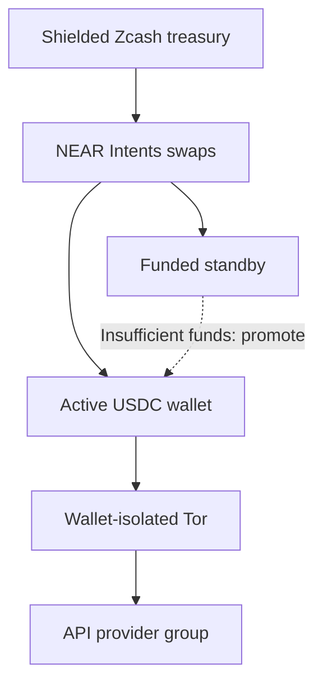

# x402_treazury

**Privacy-enhanced x402 payments for AI agents.**

X402 micropayments have a privacy problem. When you reuse your payment wallet
across multiple agents, your wallet source address lists all their API calls on
the public Base blockchain. Connecting directly to API services also exposes your
network address to these API providers and Coinbase infrastructure.

**x402_treazury** reduces that linkability with **Zcash-funded rotating wallets** and **Tor isolation tied to each payment identity**. You choose which providers share a wallet and which stay separate.

The `x402_treazury` cli tool loads x402 provider API catalogs, converts them into MCP tools, handles x402 payments, and replenishes Base USDC wallets, without giving the agent spending keys. One Rust process can serve multiple authenticated MCP endpoints with different tools and wallet groups, all filled from the same Zcash treasury wallet.

You can also optionally grant your agent a set of tools to discover and add x402 providers themselves.

## How it works



> **NOTE:**
>
> `x402_treazury` reduces wallet and network linkability; it does not make payments
> invisible. The Zcash to USDC funding path uses **public NEAR swaps and public Base
> transactions**. These are visible, but unlinkable to your Zcash shielded
> address. Because of the $2 minimum swap size, each wallet will make multiple API
> calls before rotation. Identifying request contents across these rotations can
> also link activity.

Each managed provider pool has an active Base USDC wallet, and a funded
standby USDC wallet. When the active wallet cannot cover an admitted payment,
`x402_treazury` can promote the standby and fund a new replacement address.
Calls continue on the promoted wallet while its replacement is being filled.
Funding, confirmation and payment uncertainty are persisted across restarts.

The default allocation target is **$2 USDC per address**, raised when NEAR's
current bridge minimum requires more, within your configured spending limits.
Each provider pool needs two allocations, to bootstrap the active
and standby wallets, costing roughly $4 USDC plus swap and network fees.
Separate wallet groups each need their own active and standby funding.

Payment requests, wallet-specific balance checks and swap jobs use the current
source wallet address as the Tor circuit isolation identity. An active to
standby USDC wallet rotation gets a new Tor circuit identity. API catalog
retrieval, llm help text, and pricing queries use separate Tor identities
grouped by origin. Zcash treasury synchronization has its own identity. Tor mode
uses remote DNS and has no direct-network fallback.

The CLI uses explicit commands: `serve` starts MCP serving, `catalog tools` and
`catalog tags` inspect API inventories, and `config show` / `config check` inspect
and validate configuration. `wallet` manages the treasury; `sources inspect`
reads persisted agent-added sources. Running `x402_treazury` without a command
shows help. See the [command reference](docs/configuration.md).

## Quickstart: Zcash and Tor

The [privacy example conf file](examples/deployments/privacy.toml)
provides three MCP endpoints, each with its own rotating wallet pool:

| Research context | Selected APIs | MCP endpoint |
| --- | --- | --- |
| Web | Exa, SocialFetch web/community tools, Google Trends | `http://127.0.0.1:6337/mcp` |
| Social | SocialFetch social platforms, PDL people tools | `http://127.0.0.1:6338/mcp` |
| Company | Exa, PDL company search, Otto financials/news, Claw402 startup/investor data, Deepline profiles/ads, x402stock disclosures, GenuineGood grants | `http://127.0.0.1:6339/mcp` |

SocialFetch's overlapping Reddit tools use different wallets on the web and social
endpoints; Exa likewise uses separate wallets on web and company. Company tools
are explicitly selected by name to keep the agent's context focused.

### 1. Build and start Tor

Run these commands from the repository checkout directory:

```sh
scripts/zcash.sh build
cp examples/deployments/privacy.toml examples/deployments/privacy.local.toml
```

The wrapper uses the pinned Rust/Cargo toolchain and supplies protoc.
See [build reproducibility](docs/reproducible-builds.md) for toolchain setup.

The cargo download dependencies and Zcash proving parameters are downloaded
outside of Tor routing by default.

> **NOTE:**
>
> `scripts/zcash.sh build` defaults to an optimized release build with incremental
> compiler caches disabled, including for the protoc helper. The executable is
> `target/release/x402_treazury`. Use `scripts/zcash.sh build --developer` for an
> incremental development build at `target/debug/x402_treazury`, with file/line
> backtraces and reduced debug information. See
> [build storage options](docs/development.md#build-storage-options) for tradeoffs.

Start Tor Browser, or use an installed Tor daemon. Tor is not bundled or started by
the application. The [example privacy conf file](examples/deployments/privacy.toml)
connects to Tor Browser's `127.0.0.1:9150` SOCKS port. `x402_treazury` uses
SOCKS username+password isolation, so it will not use the same Tor circuits
as your web browsing traffic.

For a dedicated daemon, use a listener such as `SocksPort 127.0.0.1:9050
IsolateSOCKSAuth` and change `network.socks_endpoint` in your local deployment
file. That same file controls initialization, synchronization and serving.
Keep Tor running throughout.

### 2. Create the treasury

```sh
target/release/x402_treazury wallet init --config examples/deployments/privacy.local.toml
target/release/x402_treazury wallet addresses --config examples/deployments/privacy.local.toml
```

Initialization creates the wallet directory specified by the config file. It
then generates a seed and discovers its birthday through Tor.

The default encryption key is `wallet.key` inside the wallet directory.
Anyone obtaining that entire directory obtains both state and decryption material.

No password or OS-keychain protection is provided at this time, but the keyfile
design is amenable to this protection in the future.

Before funding, back up the wallet and encryption key. Create a private backup
parent directory; the backup destination itself must not already exist.

```sh
mkdir -p secrets
chmod 700 secrets
target/release/x402_treazury wallet backup \
  --config examples/deployments/privacy.local.toml --destination secrets/privacy-backup
```

Keep the backup secure: it contains spending material.

> **NOTE:**
>
> Do not run multiple instances of x402_treazury from the same Zcash wallet file: cross-instance Zcash transactions will not be synchronized and USDC wallet rotation may fail. See the [wallet reference](docs/wallet-cli.md) for more details about wallet commands.

### 3. Fund and bootstrap the wallets

Display the treasury’s receive addresses:

```sh
target/release/x402_treazury wallet addresses \
  --config examples/deployments/privacy.local.toml
```

Send ZEC to the treasury's **shielded receive address**. The privacy example conf defines
**three wallet pools**, each requiring an active and standby address:
**3 x 2 x $2 = $12 USDC** for initial allocations. The treasury therefore needs
**at least $12 worth of ZEC before fees; about $15 is a practical starting preload**.

Allow more if the bridge minimum exceeds $2 or exchange rates and fees change.
This preload funds initial wallets, not unlimited calls or replacements.

To reduce that expense, **remove unused `[wallets.NAME]` definitions**, then remove
or rebind any servers/sources referencing them.

> **NOTE:**
>
> Every declared managed wallet pool initializes, even when no server uses it: removing MCP server definitions associated with a wallet pool does
> not eliminate that pool's funding setup. Keeping one pool requires two $2 allocations
> (about $4 before fees); sharing it across multiple MCP servers preserves
> separate toolsets but shares their payment identity and Tor circuit usage.

After sending ZEC, sync the treasury and check its confirmed spendable balance:

```sh
target/release/x402_treazury wallet sync \
  --config examples/deployments/privacy.local.toml
target/release/x402_treazury wallet status --config examples/deployments/privacy.local.toml
```

Once `wallet status` shows sufficient confirmed spendable ZEC, fund the initial
active and standby USDC wallets:

```sh
target/release/x402_treazury wallet bootstrap \
  --config examples/deployments/privacy.local.toml
```

Bootstrap uses the configured funding limits and waits for confirmed USDC credit.
Repeating it skips completed initial pairs and resumes unfinished funding work.
The wallets are now set up for paid discovery and API calls.

### 4. Optionally warm the catalogs

The privacy example automatically tries a [paid discovery relay](docs/configuration.md#paid-discovery-relay) when API catalog or pricing
requests are blocked or time out over Tor. This relay service is also contacted
over Tor. Its requests are paid by the wallet that is attached to the provider
that it is contacting, and these requests use Tor circuit isolation derived from that same
target wallet to connect to this relay service. If multiple wallets are assigned to a provider through multiple MCP servers (such as with the Exa provider in the privacy example conf),
one wallet is always chosen deterministically for any relayed API catalog requests.

To speed up discovery during MCP server launch, you can warm the catalog and
pricing cache before serving, with or without Tor.

The optional `--direct` flag bypasses Tor for these requests:

```sh
target/release/x402_treazury catalog warm \
  --config examples/deployments/privacy.local.toml --direct --discover-pricing
```

Omit `--direct` to warm through Tor, with paid relay fallback upon API catalog
or pricing fetch failure. Direct warming reveals your IP address to providers;
treasury traffic and paid API calls still use Tor. Only responses with suitable
caching headers can be reused while fresh, and the command reports what was
cached. See the [cache
reference](docs/configuration.md#automatic-discovery-disk-cache) for details.

### 5. Start serving

Review the wallet bindings and spending settings before starting the server:

```sh
target/release/x402_treazury config show \
  --config examples/deployments/privacy.local.toml
```

The example funds each new wallet with **2 USDC**, allows a bridge minimum up to
**3 USDC**, and limits new allocations across all pools to **20 USDC per UTC day**.
There is no lifetime funding cap; available funds in the Zcash treasury bound total
funding. Individual API payments are capped separately at
**0.05 USDC for web/social** and **0.10 USDC for company**. Conversion overhead is
limited to **5%**; standard Zcash network fees are checked separately.
These are wallet-funding allowances, not API-spending budgets. Pending transfers
remain reserved across UTC days and restarts.
See [funding limits](docs/wallet-rotation.md#funding-limits-and-fees) for the exact
accounting and optional ZEC safeguards.

Set `TREAZURY_MCP_TOKEN` to a secret bearer token, then launch:

```sh
target/release/x402_treazury serve --config examples/deployments/privacy.local.toml
```

Serving handles discovery and subsequent wallet replacement funding automatically.
If you skipped the explicit bootstrap command, serving also completes initial
wallet funding before discovery.

Connect your MCP client to the endpoint(s) in the table above, authenticating with
`Authorization: Bearer <your TREAZURY_MCP_TOKEN>`.

`wallet status` reports persisted progress. Stop with Ctrl-C and allow the announced
transaction-safety drain to finish. Wallet administration commands that need
exclusive ownership must run while serving is stopped. Local example copies,
`state/` and `secrets/` are gitignored.

> **NOTE:**
>
> For funding failures, refunds, backup restoration and RPC configuration, use the
> [wallet reference](docs/wallet-cli.md) and [rotation guide](docs/wallet-rotation.md).
> For bounded paid test runs, use the [live integration runbook](tests/live/INTEGRATION.md).

## Choose what shares a wallet

A wallet group determines which API calls reuse a payment identity until rotation.
Grouping related tools saves funding overhead; separate pools reduce address reuse
across those groups. Sharing the same wallet profile also shares its current
payment-related Tor isolation identity.

| Arrangement | Wallet sharing |
| --- | --- |
| One wallet for the deployment | All selected APIs share one pool |
| One default wallet per MCP server | APIs on each server share a pool |
| One wallet per source | A source shares its pool across listeners |
| Several sources reference one wallet | Your own provider groups |
| One wallet per server/source binding | Separate pool for each binding |

Explicit source wallets override server defaults. Automatic assignment can create
pools from one template, avoiding repeated wallet definitions:

```toml
[wallet_templates.small]
mode = "zcash_rotation"
funding_amount_usdc = "2.00"
max_api_payment_usdc = "0.05"
max_funding_spend_zec = "0.006"
max_conversion_overhead_percent = 5

[wallet_assignment]
scope = "source" # deployment, server, source, or binding
template = "small"
```

This is an alternative to explicit wallet assignments in the quickstart. Remove
those assignments where you want the automatic policy to apply; explicit references
retain priority. `config show` displays the resolved bindings and combined
active-plus-standby target before allocating anything. That target excludes fees
and bridge-minimum increases.

See [automatic wallets](examples/deployments/servers-auto-wallets.toml),
[multiple managed listeners](examples/deployments/servers-managed.toml), and the
[composition reference](docs/configuration.md#multiple-mcp-ports-from-one-configuration).

## Adding API Providers

The [provider catalog](providers/README.md) contains reusable TOML definitions,
including curated catalogs for APIs that need adaptation. Providers carry specific
reliability tags for observed issues, including Tor-related failures; startup prints
corresponding warnings. Tags describe known observations, not current availability
or proof that Tor caused a failure.

For a compatible OpenAPI provider, a source can start with just its specification URL:

```toml
[sources.my_api]
spec = "https://api.example.com/openapi.json"
```

Add `my_api` to a server's `sources`. Some providers also need a `base_url`, tool
filters, schema overrides or payment compatibility settings. Reuse bundled settings
with `extends = "../providers/exa.toml"`; add a `help_url` for a single usage guide.
Use `catalog tags` and `catalog tools` to choose a useful subset instead of exposing an
entire large catalog to the agent.

### Let agents discover and add APIs

Set `source_management = true` on each HTTP endpoint that should support agent-added
APIs. Registrations belong only to that endpoint, even when endpoints share a wallet.
Start with the [managed-wallet example](examples/deployments/agent-sources-managed.toml)
or [static-wallet example](examples/deployments/agent-sources.toml).

```toml
[source_management]
wallet = "agent_shared" # an existing wallet profile; no new pool per added API
registry_file = "../../state/agent-sources.sqlite" # omit for temporary registrations

[servers.research]
listen = "127.0.0.1:8000"
bearer_token_env = "RESEARCH_MCP_TOKEN"
source_management = true
```

Paths are relative to the deployment file. Define `wallets.agent_shared` as in the
examples. Existing wallet payment caps apply to directory searches and added APIs;
adding a source never allocates or funds a wallet. A server's explicit `wallet`
overrides the shared dynamic wallet. Ordinary server filters still limit added tools.

Enabling source management automatically adds **five tools** to the endpoint.
Directory search and service details use bundled x402 List metadata; no directory provider
or static source configuration is required. Its schema is available
offline; calls contact the live directory through the configured network policy.

| Tool | Why the agent needs it | Arguments |
| --- | --- | --- |
| `x402_treazury_sources_search` | Browse candidate APIs or request ranked recommendations from x402 List. | Optional `mode`: `browse` (default) or `best`. Both accept `q`, `network`, `category`; browse has pagination and filters, best has ranking preferences and a result limit. |
| `x402_treazury_source_details` | Inspect a candidate’s advertised endpoints, pricing and reliability before adding it. | Required directory `slug` from search, not a registered `source_id`. |
| `x402_treazury_source_add` | Add a chosen public OpenAPI API to this endpoint. The operator controls wallet selection and persistence. | Required `spec_url`; optional `name`. Repeating the same URL returns the existing registration. |
| `x402_treazury_tools_search` | Retrieve selected tool descriptions, complete argument schemas and opaque `tool_ref` values when needed. This also works when the agent framework retains an older MCP tool list. | Optional `source_id`, `query`, `cursor`, `limit`. |
| `x402_treazury_tool_call` | Call a tool discovered through `tools_search`, even if the framework has not refreshed its advertised tools. Uses normal payment admission. | Required `tool_ref` and `arguments`. |

Source management itself contributes five definitions, including the directory's
search filters and ranking options. Searches return directory results and selected tool signatures on
demand. Registered APIs also advertise their selected tools through MCP `tools/list`,
including persisted registrations restored at startup. Frameworks that include the
full tool list may therefore grow their prompt. The search/call pair supports clients
that cache their original tool list; it does not control the framework's prompt size. No separate `x402_list_*` tools
are automatically advertised. Configure x402-list explicitly only if you also want
its broader API surface.

For example, browse with `{"q":"weather","network":"BSE","per_page":10}`, or
request recommendations with
`{"mode":"best","q":"weather forecasts","network":"BSE","prefer":"cheapest","max_price_usd":0.02,"limit":3}`.
Best mode calls the directory’s `/best` endpoint; `prefer` accepts `balanced`,
`cheapest`, `fastest` or `most_reliable`. It also accepts `require_verified` and
`include_facilitator_context`. Browse uses `page`/`per_page`; best uses `limit`
(1–20). Arguments from the wrong mode are rejected. `max_price_usd` filters directory
recommendations; wallet payment caps still govern actual calls.

Inspect a result with `x402_treazury_source_details`:
`{"slug":"<slug from search>"}`. Listings and details are leads, not executable
schemas or delivery guarantees. They may lack an OpenAPI URL; verify the vendor's
published specification URL. Then:

1. Add it with `{"spec_url":"https://api.example.com/openapi.json","name":"weather"}`.
2. Inspect its signatures with `{"source_id":"<returned source_id>"}` using
   `x402_treazury_tools_search`.
3. Pass a returned reference and arguments matching its schema to
   `x402_treazury_tool_call`: `{"tool_ref":"<returned tool_ref>","arguments":{...}}`.

The last two tools work even when the agent framework caches its original MCP tool
list. References are endpoint- and process-specific; search again after restart or
if a reference is stale. Clients that refresh their MCP tool list can also call the
new `dyn_*` tools directly. Imported APIs must publish public HTTPS OpenAPI 3 JSON.

Persistence is an operator choice: configuring `registry_file` retains accepted
specifications across restarts; omitting it keeps additions only until exit. Restart
reuses the saved bytes, without automatically adopting vendor changes. Agents cannot
choose persistence, share sources with other endpoints, or alter operator limits.

Inspect saved sources at any time. Stop serving before refreshing or removing one:

```sh
target/release/x402_treazury sources inspect --config examples/deployments/agent-sources.local.toml
target/release/x402_treazury sources refresh --config examples/deployments/agent-sources.local.toml \
  --server research --source-id SOURCE_ID
target/release/x402_treazury sources remove --config examples/deployments/agent-sources.local.toml \
  --server research --source-id SOURCE_ID
```

Refresh validates a new specification; removal affects API access only, never wallet
balances or financial journals. See [agent source management](docs/agent-sources.md)
for advanced limits, network rules, and registry administration.

## MCP and startup behavior

- **Streamable HTTP and stdio.** Managed multi-server deployments use loopback
  HTTP listeners with authentication enabled by default. Standalone provider
  serving also supports stdio.
- **Multiple servers in one process.** Each listener selects sources, tools and
  wallet bindings; provider definitions are reusable across deployments.
- **Tor-oriented startup scheduling.** Catalogs use a rolling two-load default;
  pricing discovery uses a separate 16-request cap. Both are configurable. Compatible
  catalog aliases share downloads, and pricing results remain
  cached for the process. These defaults are working choices, not a universal optimum.
- **Automatic HTTP disk caching.** Deployments with existing treasury state reuse
  catalogs and pricing estimates when providers supply suitable caching headers.
  `catalog warm --config FILE --direct --discover-pricing` explicitly warms
  discovery data directly for a Tor deployment. Omitting `--source` selects all
  declared sources; add `--source ID` to narrow the selection. Selected sources
  with `http_cache_enabled = false` reject the warm run rather than being skipped.
  An optional [paid discovery relay](docs/configuration.md#paid-discovery-relay)
  uses source-assigned wallets when origin discovery fails, with an optional override.
  See [cache behavior and opt-out](docs/configuration.md#automatic-discovery-disk-cache).
- **Plain agent results.** The server handles x402 challenge/sign/retry. Bounded text
  and supported inline images become MCP results, with explicit errors for limits.

Startup currently waits for all selected catalogs and pricing discovery. Independent
provider startup is deferred. See [configuration](docs/configuration.md) for filters,
limits, startup timing, provider protocol exceptions and pricing behavior.

For a simpler static-key stdio setup, provide `EVM_PRIVATE_KEY` through the environment
or a private `.env` file:

```sh
target/release/x402_treazury serve --provider providers/socialfetch.toml \
  --network-config examples/network/tor.toml --env-file .env
```

This uses Tor but does not rotate or fund the static wallet. MCP clients should spawn
the binary with absolute config paths or a repository working directory. Logs go to
stderr; stdout carries MCP or requested CLI output. Build without the embedded Zcash
wallet with `scripts/zcash.sh build --no-default-features`.

Logging defaults to `warn,x402_treazury=info`: application milestones at `info`,
with dependency warnings and errors. Catalog and pricing completions, HTTP listener
startup and funding phase changes are milestones. Download/parse timings, HTTP
protocol details, individual cover episodes and accepted treasury tip lag are
`debug` diagnostics. Override the filter
through the process environment (including for wallet commands):

```sh
RUST_LOG='warn,x402_treazury=info,x402_treazury::treasury=debug' \
  target/release/x402_treazury serve --config /path/to/deployment.toml
```

`RUST_LOG` replaces the default filter and must be set before starting the process;
it is not read from `--env-file`. Invalid filters fail with a CLI error. Treasury
sync warnings report fixed failure categories; funding progress reports committed
phase changes with local job/pool IDs. Logs do not establish payment readiness;
use `wallet status --config /path/to/deployment.toml` for saved funding and sync state.

## Experimental HTTP/2 cover traffic

Tor mode enables bounded unsigned range traffic by default for eligible configured
sources. Explicit profiles can add randomized request-header padding and tune
concurrency and sampling distributions. This is a
research vehicle for traffic-shape experiments, **not a demonstrated defense against
traffic analysis**. It shares the real request's isolation scope and prioritizes paid
traffic.

Set `network.cover_traffic_enabled = false` to disable it globally, or
`cover_traffic_enabled = false` in a provider/source definition to disable it for that
provider. Some bundled providers already opt out for compatibility. Agent-added
sources do not automatically authorize cover traffic. See the
[cover traffic guide](docs/cover-traffic.md) for distributions, bounds and qualification.

## Documentation and status

Managed payments currently support **Base USDC v2 exact EIP-3009**. Static wallets
also support v1 exact and v2 upto; upto requires a separately provisioned Permit2
allowance. Uploads, general artifact storage and automatic polling workflows remain
outside the current tool execution model.

[Testing and qualification](docs/testing.md#qualification-status) distinguishes
implemented behavior, exercised live boundaries and outstanding acceptance. Full
automated lifecycle/restart and combined funded cover qualification remain deferred.

| Guide | What it covers |
| --- | --- |
| [Configuration](docs/configuration.md) | Sources, listeners, filters, pricing and transport options |
| [Wallet CLI](docs/wallet-cli.md) | Treasury operations, funding limits and recovery |
| [Wallet rotation](docs/wallet-rotation.md) | Admission, double buffering and durable accounting |
| [Network isolation](docs/network-egress.md) | Tor identities, connection pools and egress boundaries |
| [Development](docs/development.md) | Tests, coverage and complexity tools |
| [Documentation index](docs/README.md) | Architecture, demos, plans and further references |

Run `scripts/check.sh` for the full offline check suite. Live tests are separately
funded and opt-in; ordinary tests use temporary state and unfunded fixture keys.

## License

AGPL-3.0. See [LICENSE](LICENSE) and [CONTRIBUTING.md](CONTRIBUTING.md).

Dual licensing available.
