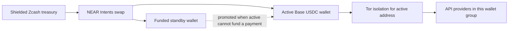

# x402_treazury

**Privacy-enhanced x402 payments for AI agents.**

Reusing a payment wallet links API calls. Connecting directly also exposes your
network address to providers.

**treazury** reduces that linkability with **Zcash-funded rotating wallets** and **Tor isolation tied to each payment identity**. You choose which providers share a wallet and which stay separate.

Treazury loads x402 provider API catalogs, converts them into MCP tools, handles x402 payments, and replenishes Base USDC wallets without giving the agent spending keys. One Rust process can serve multiple authenticated MCP endpoints with different tools and wallet groups, all filled from the same Zcash treasury wallet.

You can also optionally grant your agent a set of tools to discover and add x402 providers themselves.

## How it works



Each managed pool has an active wallet and a funded standby. When the active wallet
cannot cover an admitted payment, treazury can promote the standby and fund a new
replacement address. Calls continue on the promoted wallet while its replacement
is being filled. Funding, confirmation and payment uncertainty are persisted across
restarts; a signed payment is never automatically replayed to force a rotation.

The default allocation target is **$2 USDC per address**, raised when NEAR's current
bridge minimum requires more, within your configured spending limits. A pool needs
two allocations to bootstrap, costing roughly $4 USDC plus swap and network fees. Separate wallet groups each need their own active and standby funding.

Payment requests, wallet-specific balance checks and swap jobs use the actual EVM
address's Tor isolation identity. A rotation gets a new identity and connection pool.
Catalogs, help and pricing use separate discovery identities grouped by origin;
treasury synchronization has its own identity. Tor mode uses remote DNS and has
no direct-network fallback.

This reduces wallet and network linkability; it does not make payments invisible.
The currently qualified funding path uses **public NEAR swaps and public Base
transactions**. Circuit isolation does not guarantee different exit IPs, and shared
API credentials or identifying request contents can still link activity.
Authenticated confidential swaps remain unqualified.

## Quickstart: Zcash and Tor

Run these commands from the repository root. This example groups Botsmith, Exa,
PDL, Google Trends and Genuine Good Grants behind one managed wallet pool.

### 1. Build and start Tor

```sh
scripts/zcash.sh build
cp examples/deployments/privacy.toml examples/deployments/privacy.local.toml
```

The wrapper uses the pinned Rust/Cargo toolchain and supplies protoc. Zcash support
is included by default; reference checkouts and Python are not needed. Initial
builds may download dependencies and proving parameters outside runtime Tor routing.
See [build reproducibility](docs/reproducible-builds.md) for toolchain setup.

Start Tor Browser, or use an installed Tor daemon. Tor is not bundled or started by
the application. The example connects to Tor Browser's `127.0.0.1:9150` SOCKS port.
For a dedicated daemon, use a listener such as
`SocksPort 127.0.0.1:9050 IsolateSOCKSAuth` and change `network.socks_endpoint` in
your local deployment file. That same file controls initialization, synchronization
and serving. Keep Tor running throughout.

### 2. Create the treasury

The default Zcash indexer and submission endpoint is `https://zec.rocks:443`;
no endpoint environment variables are required. Set `TREAZURY_MCP_TOKEN` to a
private bearer token for your MCP client (for example, generate one with
`openssl rand -hex 32` and store it in your secret manager).

```sh
target/debug/treazury wallet init --config examples/deployments/privacy.local.toml
target/debug/treazury wallet addresses --config examples/deployments/privacy.local.toml
```

Initialization creates the wallet directory, generates a seed and discovers its
birthday through Tor. The treasury ID is read automatically from wallet state;
there is no ID to copy into TOML. Initialization refuses an existing wallet. Imports
require an explicit birthday; see the [wallet reference](docs/wallet-cli.md).

The default encryption key is `wallet.key` inside the owner-only wallet directory.
Anyone obtaining that entire directory obtains both state and decryption material.
Set `treasury.key_file` to keep the key elsewhere if your storage or backup policy
needs separation. No password or OS-keychain protection is implied.

Before funding, back up the wallet and encryption key. Create a private backup
parent directory; the backup destination itself must not already exist.

```sh
mkdir -p secrets
chmod 700 secrets
target/debug/treazury wallet backup \
  --config examples/deployments/privacy.local.toml --destination secrets/privacy-backup
```

Keep the backup secure: it contains spending material. Never operate the original
and a restored copy concurrently.

### 3. Review, fund and launch

```sh
# Offline: inspect wallet bindings, funding targets and network policy.
target/debug/treazury \
  --config examples/deployments/privacy.local.toml --show-config

# Fetch the catalog through Tor and validate selected tools; no payments.
target/debug/treazury \
  --config examples/deployments/privacy.local.toml --check
```

Send ZEC to the treasury's **shielded receive address**. Budget for both wallet
allocations and fees; the bridge minimum and ZEC exchange rate can change.
The example limits individual API payments to **$0.05**, each source operation to
**0.006 ZEC**, daily source exposure to **0.012 ZEC**, quoted overhead to **500 bps**,
and each refund-shielding fee to **0.0003 ZEC**. These are ceilings, not estimates;
they may need deliberate adjustment for the current route. Daily limits reset and
per-payment caps are not lifetime budgets.

```sh
target/debug/treazury wallet sync \
  --config examples/deployments/privacy.local.toml
target/debug/treazury wallet status --config examples/deployments/privacy.local.toml
```

Once the confirmed spendable balance is sufficient and you have reviewed those
limits, launch the server. **Managed serving automatically funds the initial pair
and later replacements**, using real ZEC within the configured limits. Set
`funding.auto_fund = false` to pause automatic funding. Initialization, inspection,
backup and `wallet sync` never start funding workers. Ensure `TREAZURY_MCP_TOKEN`
is set, then:

```sh
target/debug/treazury --config examples/deployments/privacy.local.toml
```

Connect your MCP client to **`http://127.0.0.1:8000/mcp`**, authenticating with
`Authorization: Bearer <your TREAZURY_MCP_TOKEN>`. Wait for an active wallet and a
ready standby before paid use. List tools in your MCP client, read the provider
help, and select a request within the configured payment cap. Help is fetched on
demand and cached for the process.

`wallet status` reports persisted progress. Stop with Ctrl-C and allow the announced
transaction-safety drain to finish. Wallet administration commands that need
exclusive ownership must run while serving is stopped. Local example copies,
`state/` and `secrets/` are gitignored.

For funding failures, refunds, backup restoration and RPC configuration, use the
[wallet reference](docs/wallet-cli.md) and [rotation guide](docs/wallet-rotation.md).
For bounded paid test runs, use the [live integration runbook](tests/live/INTEGRATION.md).

## Choose what shares a wallet

A wallet group determines which API calls reuse a payment identity until rotation.
Grouping related tools saves funding overhead; separate pools reduce address reuse
across those groups. Sharing the same wallet profile also shares its current
payment-related Tor isolation identity.

| Arrangement | Wallet sharing |
| --- | --- |
| One wallet for the deployment | All selected APIs share one pool |
| One default wallet per MCP server | APIs on each server share a pool |
| One wallet per source | A source shares its pool across listeners |
| Several sources reference one wallet | Your own provider groups |
| One wallet per server/source binding | Separate pool for each binding |

Explicit source wallets override server defaults. Automatic assignment can create
pools from one template, avoiding repeated wallet definitions:

```toml
[wallet_templates.small]
mode = "zcash_rotation"
deposit_size = "2.00"
max_price_usd = "0.05"
max_input_zec = "0.006"
max_fee_bps = 500

[wallet_assignment]
scope = "source" # deployment, server, source, or binding
template = "small"
```

This is an alternative to explicit wallet assignments in the quickstart. Remove
those assignments where you want the automatic policy to apply; explicit references
retain priority. `--show-config` displays the resolved bindings and combined
active-plus-standby target before allocating anything. That target excludes fees
and bridge-minimum increases.

See [automatic wallets](examples/deployments/servers-auto-wallets.toml),
[multiple managed listeners](examples/deployments/servers-managed.toml), and the
[composition reference](docs/configuration.md#multiple-mcp-ports-from-one-configuration).

## Bring your APIs

The [provider catalog](providers/README.md) contains reusable TOML definitions,
including curated catalogs for APIs that need adaptation. Providers carry specific
reliability tags for observed issues, including Tor-related failures; startup prints
corresponding warnings. Tags describe known observations, not current availability
or proof that Tor caused a failure.

For a compatible OpenAPI provider, a source can start with just its specification URL:

```toml
[sources.my_api]
spec = "https://api.example.com/openapi.json"
```

Add `my_api` to a server's `sources`. Some providers also need a `base_url`, tool
filters, schema overrides or payment compatibility settings. Reuse bundled settings
with `extends = "../providers/exa.toml"`; add a `help_url` for a single usage guide.
Use `--list-tags` and `--list-tools` to choose a useful subset instead of exposing an
entire large catalog to the agent.

Optional [agent source management](docs/agent-sources.md) lets authorized agents
inspect and add OpenAPI sources within configured listener, process or persistent
scope. It is disabled by default; grants control destinations, persistence and wallet
bindings. Start with [the managed example](examples/deployments/agent-sources-managed.toml),
which shares an explicit wallet for agent-added sources to avoid a funded pool per
addition. Discovery does not grant spending or source-registration authority.

## MCP and startup behavior

- **Streamable HTTP and stdio.** Managed multi-server deployments use authenticated
  loopback HTTP listeners. Standalone provider serving also supports stdio.
- **Multiple servers in one process.** Each listener selects sources, tools and
  wallet bindings; provider definitions are reusable across deployments.
- **Tor-oriented startup scheduling.** Catalogs use a rolling two-load default;
  pricing discovery uses a separate 16-request cap. Both are configurable. Compatible
  catalog aliases share downloads, and pricing results remain
  cached for the process. These defaults are working choices, not a universal optimum.
- **Plain agent results.** The server handles x402 challenge/sign/retry. Bounded text
  and supported inline images become MCP results, with explicit errors for limits.

Startup currently waits for all selected catalogs and pricing discovery. Independent
provider startup is deferred. See [configuration](docs/configuration.md) for filters,
limits, startup timing, provider protocol exceptions and pricing behavior.

For a simpler static-key stdio setup, provide `EVM_PRIVATE_KEY` through the environment
or a private `.env` file:

```sh
target/debug/treazury --provider providers/socialfetch.toml \
  --network-config examples/network/tor.toml --env-file .env
```

This uses Tor but does not rotate or fund the static wallet. MCP clients should spawn
the binary with absolute config paths or a repository working directory. Logs go to
stderr; stdout carries MCP or requested CLI output. Build without the embedded Zcash
wallet with `scripts/zcash.sh build --no-default-features`.

## Experimental HTTP/2 cover traffic

Tor mode enables bounded unsigned range traffic by default for eligible configured
sources. Explicit profiles can add randomized request-header padding and tune
concurrency and sampling distributions. This is a
research vehicle for traffic-shape experiments, **not a demonstrated defense against
traffic analysis**. It shares the real request's isolation scope and prioritizes paid
traffic.

Set `network.cover_traffic_enabled = false` to disable it globally, or
`cover_traffic_enabled = false` in a provider/source definition to disable it for that
provider. Some bundled providers already opt out for compatibility. Agent-added
sources do not automatically authorize cover traffic. See the
[cover traffic guide](docs/cover-traffic.md) for distributions, bounds and qualification.

## Documentation and status

Managed payments currently support **Base USDC v2 exact EIP-3009**. Static wallets
also support v1 exact and v2 upto; upto requires a separately provisioned Permit2
allowance. Uploads, general artifact storage and automatic polling workflows remain
outside the current tool execution model.

[Testing and qualification](docs/testing.md#qualification-status) distinguishes
implemented behavior, exercised live boundaries and outstanding acceptance. Full
automated lifecycle/restart and combined funded cover qualification remain deferred.

| Guide | What it covers |
| --- | --- |
| [Configuration](docs/configuration.md) | Sources, listeners, filters, pricing and transport options |
| [Wallet CLI](docs/wallet-cli.md) | Treasury operations, funding limits and recovery |
| [Wallet rotation](docs/wallet-rotation.md) | Admission, double buffering and durable accounting |
| [Network isolation](docs/network-egress.md) | Tor identities, connection pools and egress boundaries |
| [Development](docs/development.md) | Tests, coverage and complexity tools |
| [Documentation index](docs/README.md) | Architecture, demos, plans and further references |

Run `scripts/check.sh` for the full offline check suite. Live tests are separately
funded and opt-in; ordinary tests use temporary state and unfunded fixture keys.

## License

AGPL-3.0. See [LICENSE](LICENSE) and [CONTRIBUTING.md](CONTRIBUTING.md).

Dual licensing available.
