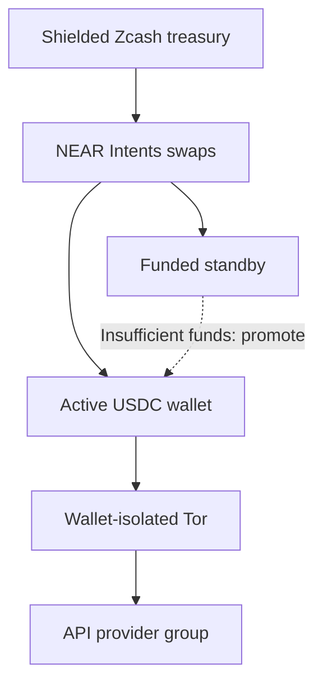

# x402_treazury

**Privacy-enhanced x402 payments for AI agents.**

X402 micropayments have a privacy problem. When you reuse your payment wallet
across multiple agents, your wallet source address lists all their API calls on
the public Base blockchain. Connecting directly to API services also exposes your
network address to these API providers and Coinbase infrastructure.

**x402_treazury** reduces that linkability with **Zcash-funded rotating wallets** and **Tor isolation tied to each payment identity**. You choose which providers share a wallet and which stay separate.

The `x402_treazury` cli tool loads x402 provider API catalogs, converts them into MCP tools, handles x402 payments, and replenishes Base USDC wallets, without giving the agent spending keys. One Rust process can serve multiple authenticated MCP endpoints with different tools and wallet groups, all filled from the same Zcash treasury wallet.

You can also optionally grant your agent a set of tools to discover and add x402 providers themselves.

## How it works



> **NOTE:**
>
> `x402_treazury` reduces wallet and network linkability; it does not make payments
> invisible. The Zcash to USDC funding path uses **public NEAR swaps and public Base
> transactions**. These are visible, but unlinkable to your Zcash shielded
> address. Because of the $2 minimum swap size, each wallet will make multiple API
> calls before rotation. Identifying request contents across these rotations can
> also link activity.

Each managed provider pool has an active Base USDC wallet, and a funded
standby USDC wallet. When the active wallet cannot cover an admitted payment,
`x402_treazury` can promote the standby and fund a new replacement address.
Calls continue on the promoted wallet while its replacement is being filled.
Funding, confirmation and payment uncertainty are persisted across restarts.

The default allocation target is **$2 USDC per address**, raised when NEAR's
current bridge minimum requires more, within your configured spending limits.
Each provider pool needs two allocations, to bootstrap the active
and standby wallets, costing roughly $4 USDC plus swap and network fees.
Separate wallet groups each need their own active and standby funding.

Payment requests, wallet-specific balance checks and swap jobs use the current
source wallet address as the Tor circuit isolation identity. An active to
standby USDC wallet rotation gets a new Tor circuit identity. API catalog
retrieval, llm help text, and pricing queries use separate Tor identities
grouped by origin. Zcash treasury synchronization has its own identity. Tor mode
uses remote DNS and has no direct-network fallback.


The CLI uses explicit commands: `serve` starts MCP serving, `catalog tools` and
`catalog tags` inspect API inventories, and `config show` / `config check` inspect
and validate configuration. `wallet` manages the treasury; `sources inspect`
reads persisted agent-added sources. Running `x402_treazury` without a command
shows help. See the [command reference](docs/configuration.md).

## Quickstart: Zcash and Tor

The [privacy example conf file](examples/deployments/privacy.toml)
provides three MCP endpoints, each with its own rotating wallet pool:

| Research context | Selected APIs | MCP endpoint |
| --- | --- | --- |
| Web | Exa, SocialFetch web/community tools, Google Trends | `http://127.0.0.1:6337/mcp` |
| Social | SocialFetch social platforms, PDL people tools | `http://127.0.0.1:6338/mcp` |
| Company | Exa, PDL company search, Otto financials/news, Claw402 startup/investor data, Deepline profiles/ads, x402stock disclosures, GenuineGood grants | `http://127.0.0.1:6339/mcp` |

SocialFetch's overlapping Reddit tools use different wallets on the web and social
endpoints; Exa likewise uses separate wallets on web and company. Company tools
are explicitly selected by name to keep the agent's context focused.

### 1. Build and start Tor

Run these commands from the repository checkout directory:

```sh
scripts/zcash.sh build
cp examples/deployments/privacy.toml examples/deployments/privacy.local.toml
```

The wrapper uses the pinned Rust/Cargo toolchain and supplies protoc.
See [build reproducibility](docs/reproducible-builds.md) for toolchain setup.

The cargo download dependencies and Zcash proving parameters are downloaded
outside of Tor routing by default.

Start Tor Browser, or use an installed Tor daemon. Tor is not bundled or started by
the application. The [example privacy conf file](examples/deployments/privacy.toml)
connects to Tor Browser's `127.0.0.1:9150` SOCKS port. `x402_treazury` uses
SOCKS username+password isolation, so it will not use the same Tor circuits
as your web browsing traffic.

For a dedicated daemon, use a listener such as `SocksPort 127.0.0.1:9050
IsolateSOCKSAuth` and change `network.socks_endpoint` in your local deployment
file. That same file controls initialization, synchronization and serving.
Keep Tor running throughout.

### 2. Create the treasury

```sh
target/debug/x402_treazury wallet init --config examples/deployments/privacy.local.toml
target/debug/x402_treazury wallet addresses --config examples/deployments/privacy.local.toml
```

Initialization creates the wallet directory specified by the config file. It
then generates a seed and discovers its birthday through Tor.

The default encryption key is `wallet.key` inside the wallet directory.
Anyone obtaining that entire directory obtains both state and decryption material.

No password or OS-keychain protection is provided at this time, but the keyfile
design is amenable to this protection in the future.

Before funding, back up the wallet and encryption key. Create a private backup
parent directory; the backup destination itself must not already exist.

```sh
mkdir -p secrets
chmod 700 secrets
target/debug/x402_treazury wallet backup \
  --config examples/deployments/privacy.local.toml --destination secrets/privacy-backup
```

Keep the backup secure: it contains spending material.

> **NOTE:**
>
> Do not run multiple instances of x402_treazury from the same Zcash wallet file: cross-instance Zcash transactions will not be synchonized and USDC wallet rotation may fail. See the [wallet reference](docs/wallet-cli.md) for more details about wallet commands.

### 3. Review, fund and launch

```sh
# Offline: inspect wallet bindings, funding targets and network policy.
target/debug/x402_treazury config show \
  --config examples/deployments/privacy.local.toml

# Fetch the catalog through Tor and validate selected tools; no payments.
target/debug/x402_treazury config check \
  --config examples/deployments/privacy.local.toml
```

Send ZEC to the treasury's **shielded receive address**. The privacy example conf defines
**three wallet pools**, each requiring an active and standby address:
**3 x 2 x $2 = $12 USDC** for initial allocations. The treasury therefore needs
**at least $12 worth of ZEC before fees; about $15 is a practical starting preload**.

Allow more if the bridge minimum exceeds $2 or exchange rates and fees change.
This preload funds initial wallets, not unlimited calls or replacements.

To reduce that expense, **remove unused `[wallets.NAME]` definitions**, then remove
or rebind any servers/sources referencing them.

> **NOTE:**
>
> Every declared managed wallet pool initializes, even when no server uses it: removing MCP server definitions associated with a wallet pool does
> not eliminate that pool's funding setup. Keeping one pool requires two $2 allocations
> (about $4 before fees); sharing it across multiple MCP servers preserves
> separate toolsets but shares their payment identity and Tor circuit usage.

The example limits individual API payments to **$0.05 for web/social** and
**$0.10 for company**, each source operation to
**0.006 ZEC**, daily source exposure to **0.012 ZEC**, quoted overhead to **500 bps**,
and each refund-shielding fee to **0.0003 ZEC**. These are ceilings, not estimates;
they may need deliberate adjustment for the current route. Daily limits reset and
per-payment caps are not lifetime budgets.

```sh
target/debug/x402_treazury wallet sync \
  --config examples/deployments/privacy.local.toml
target/debug/x402_treazury wallet status --config examples/deployments/privacy.local.toml
```

Once the confirmed spendable balance is sufficient and you have reviewed those
limits, launch the servers. **Managed serving automatically funds each wallet pool's
initial USDC pair and later replacements**, using real ZEC within the configured
limits, once you start the MCP server. Initialization, inspection, backup and
`wallet sync` do not perform USDC funding.

Once you are ready to begin USDC funding, ensure `TREAZURY_MCP_TOKEN` is set, then:

```sh
target/debug/x402_treazury serve --config examples/deployments/privacy.local.toml
```

Connect your MCP client to the endpoint(s) in the table above, authenticating with
`Authorization: Bearer <your TREAZURY_MCP_TOKEN>`. Authentication is on by default;
to disable it for a listener, set `auth = false` and omit `bearer_token_env` in its
server table. Standalone HTTP supports `--no-auth`. Startup warns when auth is off.

Wait for an active wallet and ready standby in each selected pool before paid
use.  Where exposed, help text for help tools is fetched on upon first tool
call and cached for the process. PDL person matches are vendor-listed at $0.28
and exceed the social pool's default cap in the example privacy conf; raise
that cap deliberately if you need paid matches.

`wallet status` reports persisted progress. Stop with Ctrl-C and allow the announced
transaction-safety drain to finish. Wallet administration commands that need
exclusive ownership must run while serving is stopped. Local example copies,
`state/` and `secrets/` are gitignored.

> **NOTE:**
>
> For funding failures, refunds, backup restoration and RPC configuration, use the
> [wallet reference](docs/wallet-cli.md) and [rotation guide](docs/wallet-rotation.md).
> For bounded paid test runs, use the [live integration runbook](tests/live/INTEGRATION.md).

## Choose what shares a wallet

A wallet group determines which API calls reuse a payment identity until rotation.
Grouping related tools saves funding overhead; separate pools reduce address reuse
across those groups. Sharing the same wallet profile also shares its current
payment-related Tor isolation identity.

| Arrangement | Wallet sharing |
| --- | --- |
| One wallet for the deployment | All selected APIs share one pool |
| One default wallet per MCP server | APIs on each server share a pool |
| One wallet per source | A source shares its pool across listeners |
| Several sources reference one wallet | Your own provider groups |
| One wallet per server/source binding | Separate pool for each binding |

Explicit source wallets override server defaults. Automatic assignment can create
pools from one template, avoiding repeated wallet definitions:

```toml
[wallet_templates.small]
mode = "zcash_rotation"
deposit_size = "2.00"
max_price_usd = "0.05"
max_input_zec = "0.006"
max_fee_bps = 500

[wallet_assignment]
scope = "source" # deployment, server, source, or binding
template = "small"
```

This is an alternative to explicit wallet assignments in the quickstart. Remove
those assignments where you want the automatic policy to apply; explicit references
retain priority. `config show` displays the resolved bindings and combined
active-plus-standby target before allocating anything. That target excludes fees
and bridge-minimum increases.

See [automatic wallets](examples/deployments/servers-auto-wallets.toml),
[multiple managed listeners](examples/deployments/servers-managed.toml), and the
[composition reference](docs/configuration.md#multiple-mcp-ports-from-one-configuration).

## Adding API Providers

The [provider catalog](providers/README.md) contains reusable TOML definitions,
including curated catalogs for APIs that need adaptation. Providers carry specific
reliability tags for observed issues, including Tor-related failures; startup prints
corresponding warnings. Tags describe known observations, not current availability
or proof that Tor caused a failure.

For a compatible OpenAPI provider, a source can start with just its specification URL:

```toml
[sources.my_api]
spec = "https://api.example.com/openapi.json"
```

Add `my_api` to a server's `sources`. Some providers also need a `base_url`, tool
filters, schema overrides or payment compatibility settings. Reuse bundled settings
with `extends = "../providers/exa.toml"`; add a `help_url` for a single usage guide.
Use `catalog tags` and `catalog tools` to choose a useful subset instead of exposing an
entire large catalog to the agent.

Optional [agent source management](docs/agent-sources.md) lets authorized agents
inspect and add OpenAPI sources within configured listener, process or persistent
scope. It is disabled by default; grants control destinations, persistence and wallet
bindings. Start with [the managed example](examples/deployments/agent-sources-managed.toml),
which shares an explicit wallet for agent-added sources to avoid a funded pool per
addition. Discovery does not grant spending or source-registration authority.

## MCP and startup behavior

- **Streamable HTTP and stdio.** Managed multi-server deployments use loopback
  HTTP listeners with authentication enabled by default. Standalone provider
  serving also supports stdio.
- **Multiple servers in one process.** Each listener selects sources, tools and
  wallet bindings; provider definitions are reusable across deployments.
- **Tor-oriented startup scheduling.** Catalogs use a rolling two-load default;
  pricing discovery uses a separate 16-request cap. Both are configurable. Compatible
  catalog aliases share downloads, and pricing results remain
  cached for the process. These defaults are working choices, not a universal optimum.
- **Automatic HTTP disk caching.** Deployments with existing treasury state reuse
  catalogs and pricing estimates when providers supply suitable caching headers.
  See [cache behavior and opt-out](docs/configuration.md#automatic-discovery-disk-cache).
- **Plain agent results.** The server handles x402 challenge/sign/retry. Bounded text
  and supported inline images become MCP results, with explicit errors for limits.

Startup currently waits for all selected catalogs and pricing discovery. Independent
provider startup is deferred. See [configuration](docs/configuration.md) for filters,
limits, startup timing, provider protocol exceptions and pricing behavior.

For a simpler static-key stdio setup, provide `EVM_PRIVATE_KEY` through the environment
or a private `.env` file:

```sh
target/debug/x402_treazury serve --provider providers/socialfetch.toml \
  --network-config examples/network/tor.toml --env-file .env
```

This uses Tor but does not rotate or fund the static wallet. MCP clients should spawn
the binary with absolute config paths or a repository working directory. Logs go to
stderr; stdout carries MCP or requested CLI output. Build without the embedded Zcash
wallet with `scripts/zcash.sh build --no-default-features`.

Logging defaults to `warn,x402_treazury=info`: application milestones at `info`,
with dependency warnings and errors. Catalog and pricing completions, HTTP listener
startup and funding phase changes are milestones. Download/parse timings, HTTP
protocol details, individual cover episodes and accepted treasury tip lag are
`debug` diagnostics. Override the filter
through the process environment (including for wallet commands):

```sh
RUST_LOG='warn,x402_treazury=info,x402_treazury::treasury=debug' \
  target/debug/x402_treazury serve --config /path/to/deployment.toml
```

`RUST_LOG` replaces the default filter and must be set before starting the process;
it is not read from `--env-file`. Invalid filters fail with a CLI error. Treasury
sync warnings report fixed failure categories; funding progress reports committed
phase changes with local job/pool IDs. Logs do not establish payment readiness;
use `wallet status --config /path/to/deployment.toml` for saved funding and sync state.

## Experimental HTTP/2 cover traffic

Tor mode enables bounded unsigned range traffic by default for eligible configured
sources. Explicit profiles can add randomized request-header padding and tune
concurrency and sampling distributions. This is a
research vehicle for traffic-shape experiments, **not a demonstrated defense against
traffic analysis**. It shares the real request's isolation scope and prioritizes paid
traffic.

Set `network.cover_traffic_enabled = false` to disable it globally, or
`cover_traffic_enabled = false` in a provider/source definition to disable it for that
provider. Some bundled providers already opt out for compatibility. Agent-added
sources do not automatically authorize cover traffic. See the
[cover traffic guide](docs/cover-traffic.md) for distributions, bounds and qualification.

## Documentation and status

Managed payments currently support **Base USDC v2 exact EIP-3009**. Static wallets
also support v1 exact and v2 upto; upto requires a separately provisioned Permit2
allowance. Uploads, general artifact storage and automatic polling workflows remain
outside the current tool execution model.

[Testing and qualification](docs/testing.md#qualification-status) distinguishes
implemented behavior, exercised live boundaries and outstanding acceptance. Full
automated lifecycle/restart and combined funded cover qualification remain deferred.

| Guide | What it covers |
| --- | --- |
| [Configuration](docs/configuration.md) | Sources, listeners, filters, pricing and transport options |
| [Wallet CLI](docs/wallet-cli.md) | Treasury operations, funding limits and recovery |
| [Wallet rotation](docs/wallet-rotation.md) | Admission, double buffering and durable accounting |
| [Network isolation](docs/network-egress.md) | Tor identities, connection pools and egress boundaries |
| [Development](docs/development.md) | Tests, coverage and complexity tools |
| [Documentation index](docs/README.md) | Architecture, demos, plans and further references |

Run `scripts/check.sh` for the full offline check suite. Live tests are separately
funded and opt-in; ordinary tests use temporary state and unfunded fixture keys.

## License

AGPL-3.0. See [LICENSE](LICENSE) and [CONTRIBUTING.md](CONTRIBUTING.md).

Dual licensing available.
